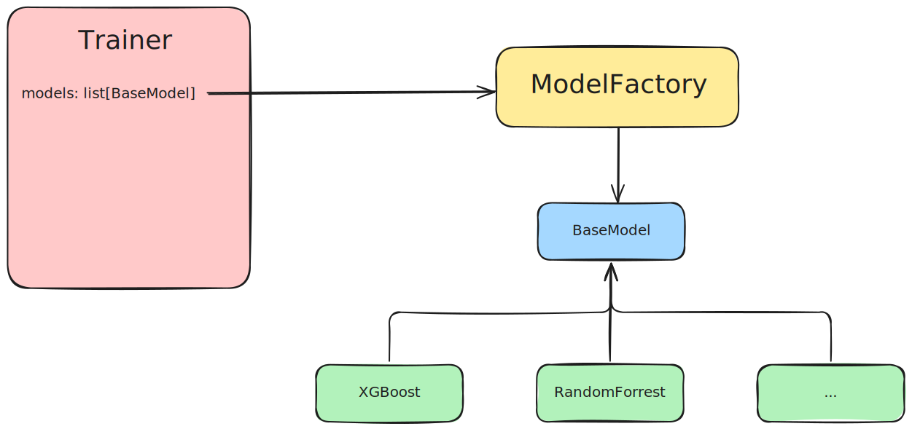

# MLOps

## Project Setup

### Pre-Commit

This project uses **pre-commit** for linting and formatting the code before it is actively committed to the codebase.
This helps to ensure code quality and code readability.

To install pre-commit, the following command can simply be run in the terminal.

```
# Install pre-commit
pip install pre-commit
```

In the root directory of the project there is a `.pre-commit-config.yaml` file in which the pre-commit hooks are configured.

In order for the pre-commit hooks to be executed automatically before each commit, the following command must be executed in the terminal.

```
# Install pre-commit hooks
pre-commit install
```

For more information visit the [pre-commit website](https://pre-commit.com/).

### Installation

The project is divided into three sub-projects, a fastapi backend and a streamlit frontend and a sphinx documentation. Besides that a Dockerfile for the *MLFlow Server* is implemented.
Each of these sub-projects has its own `pyproject.toml` with which the project and its dependencies can be installed.


*There is also a `requirements.txt` in the root directory to install all dependencies into a single isolated environment. The separation of `pyproject.toml` is necessary for the containerisation of the two components of the application*

**Single installation**

1. Create a virtual environment to install the project dependencies in isolation.
This can be done by running `python -m venv .venv`.
2. To *activate* the environment run `source .venv/bin/activate` on mac/ linux or `./.venv/Scripts/activate` on windows.
3. To install all dependencies and to be able to develop and contribute to the project run `python -m pip install -r requirements.txt`

**Install backend**

1. To install the backend (fastapi restapi) switch the directory to *backend*
with `cd backend`.
2. Create a virtual environment to install the project dependencies in isolation.
This can be done by running `python -m venv .venv`.
3. To *activate* the environment run `source .venv/bin/activate` on mac/ linux or `./.venv/Scripts/activate` on windows.
4. To install all dependencies and to be able to develop and contribute to the project run `python -m pip install -e .'[dev]'`

**Install frontend**

1. To install the frontend (gradio) switch the directory to *backend*
with `cd frontend`.
2. Create a virtual environment to install the project dependencies in isolation.
This can be done by running `python -m venv .venv`.
3. To *activate* the environment run `source .venv/bin/activate` on mac/ linux or `./.venv/Scripts/activate` on windows.
4. To install all dependencies and to be able to develop and contribute to the project run `python -m pip install -e .'[dev]'`

**Build the docs**

To build the documentation locally, use `cd docs` to change to the directory. The following command needs to be executed to build the docs:

```
rm -rf build & sphinx-build -b html ./source ./build
```

To start the documentation locally, the following must be run:

```
python -m http.server 8080 --directory ./build
```

# Project Structure

The project is structured into the following folder structure.

```
project/
├── backend/
│   ├── notebooks/ # Notebooks for experiments
│   ├── src/ # Backend implementation
│   │    │── training/ # Implementation of Trainings
│   │         │── data # origin Data for training
│   │         │── models/ # Base Model and Models for Experiments
│   ├── tests/ # Backend tests
│   ├── Dockerfile # Containerization
│   ├── pyproject.toml # Dependencies
│   └── settings.yaml # Setting File
├── frontend/
│   ├── src/ # Frontend implementation
│   ├── tests/ # Frontend tests
│   ├── Dockerfile # Containerization
│   ├── pyproject.toml # Dependencies
│   └── ...
├── docs/
│   ├── build/ # Frontend implementation
│   ├── source/ # Frontend tests
│   ├── Dockerfile # Containerization
│   └── pyproject.toml # Dependencies
├── .pre-commit-config.yaml # pre-commit config
├── README.md # Project overview
└── ...
```

## VS Code (Debug) Run Config

In addition to the local start run configurations are available for the `frontend` and `backend`, which can be selected at the top left in vs code next to the green play button.

It is **important** to have installed the dependencies beforehand and to have selected the correct python interpreter in the IDE.

The respective run config has set the `current working directory` to the project folder so that the `dynconf settings` can be read correctly.

The mlflow must be started manually in the backend with `mlflow ui`.

```
# launch.json
{
    "version": "0.2.0",
    "configurations": [

        {
            "name": "Backend",
            "type": "debugpy",
            "request": "launch",
            "module": "uvicorn",
            "cwd": "${workspaceFolder}/backend",
            "args": [
                "src.main:app",
                "--reload"
            ],
            "jinja": true
        },
        {
            "name": "Frontend",
            "type": "debugpy",
            "request": "launch",
            "module": "streamlit",
            "cwd": "${workspaceFolder}/frontend",
            "args": [
                "run",
                "src/main.py"
            ],
            "console": "integratedTerminal"
        }
    ]
}
```

# Containerization

## Docker

All sub-projects include a related `Dockerfile`.
You can build the image by running the following commands:

**backend**
```
# Switch to backend directory
cd backend
# Build
docker build -t mlops-backend .
# Run on port 8080
docker run -d -p 8080:8080 --restart unless-stopped --name mlops-backend mlops-backend
```

**frontend**
```
# Switch to frontend directory
cd frontend
# Build
docker build -t mlops-frontend .
# Run on port 8501
docker run -d -p 8501:8501 --restart unless-stopped --name mlops-frontend mlops-frontend
# Open Frontend for Inference via http://127.0.0.1:8501
````

**docs**
```
# Switch to frontend directory
cd docs
# Build
docker build -t docs .
# Run on port 8000
docker run -d -p 8000:8000  --name docs docs
# Open Frontend for Inference via http://127.0.0.1:8000
```

## Docker Compose

This `docker-compose.yaml` file defines a multi-container application with four services: mlflow, backend, frontend, and docs. It also uses a shared volume named `mlflow_data` to persist data.

The services are built from their respective Dockerfiles and directories.

The services communicate with each other using Docker's internal networking (e.g., http://mlflow, http://backend, etc.).

The shared volume (`mlflow_data`) ensures that experiment data is persisted and accessible across services (`mlflow`, `backend`).

# Training

## Adding New Experiments

To train a new model, it must be added under models in `settings.yaml`. The trainer is provided a list of models from models section and instanciates them with the `ModelFactory`.



### Adding new Models

To Add a new model it must inherit from the `BaseModel`and therefore implement its `optimze` method to run a *Optuna* hyperparameter optimization study.

The existing models `RandomForest` and `XGBoost` serve as examples.


## Versioning of Training Data
To ensure versioning of training data, the data is stored as an artifact for each experiment. Additionally, all relevant metrics for the model are logged in MLflow. Each training dataset is evaluated as described, and the corresponding information is stored as artifacts in the MLflow backend.

## Automated Analysis of New Data

### Goal

The automated analysis checks whether newly incoming data still matches the data originally used for model training. This ensures that the model continues to make reliable predictions in the future. Changes in data structure or distributions can be detected and addressed early on.

The analysis runs automatically, creates an HTML report, and saves all results as artifacts in MLflow.

### What is specifically done?

#### 1. Comparison of old and new data

- Have columns been removed or added?
- Have data types changed?
- Are there changes in the value range for numerical variables?
- For categorical variables, have categories been added or removed?

#### 2. Examination of distributions

- Target variable ("income"): Has the distribution changed?
- For all features: Graphical comparison of the distribution between old and new datasets

#### 3. Calculation of correlations

- Which features correlate strongly with the target variable?
- Are there strong correlations between individual features?

#### 4. Further data quality checks and handling instructions

- Check for missing values (NaN or "?")
- Identification of duplicates
- Check for highly imbalanced features (e.g., features where a single value accounts for over 95% of the data)

### Next steps

The code developed here allows for quick and systematic identification of potential problem areas in the data in the future. It also provides concrete suggestions on which cleanups should be performed before retraining the model if necessary.


## Data Preparation

Data preparation is performed using an `sklearn` pipeline as seen in the example models. Each model can use a “customprocessor” and a “preprocessor” to prepare the data. The “customprocessor” adjusts the fields according to the findings from the data evaluation. The preprocessor is used to encode the categorical data “one-hot”, for example, or to use a `MinMaxScaler` for numerical values. This pipeline is stored together with the model in the MLflow backend after training and is used for inference. This ensures that all data is processed consistently within the model.

## Hyperparameter Tuning

For the example models, hyperparameter tuning is performed. The best result from this Optuna study is then stored in MLflow Models for each model. The value ranges for hyperparameter tuning are defined in the respective model class.

## Labeling of models

The latest model is labeled as newest. Note that multiple experiments may result in multiple models labeled as newest. It is recommended to use labels such as "Production" and "Staging" to maintain clarity when accessing models via the backend. This labeling must be performed manually in the MLflow backend to ensure a clear transition between staging and production.

## Adding new data

New training data can be added via Fileupload to the backend. When new training data is added, retraining is performed, and the training data, model, and corresponding results are stored. If the model should be deployed to production, it must be labeled accordingly and loaded into the backend via the /set_model endpoint. The settings.yaml file allows specifying the general path for training data and the path to the original training data. During training, a comparison between the current and original training data is performed and documented in report.html in the artifacts folder. Additional visualizations of the training dataset can also be found in the artifacts folder. The training of new models occurs in the background and does not block the API

# Live-Mode

## REST-API Backend

The Rest API currently consists of four endpoints.

- `/health` - To check the application health
- `predict` - To perform inference on a loaded model
- `set_model` - To deploy a new model by mlflow alias
- `model-info` - To receive information on the current deployed model
- `upload_data` - To upload new data

An initial training is performed during the start up of the API.

**IMPORTANT**: There will be a delay when starting for the first time)

To use one of the trained models via the backend, it must be assigned a `alias` in mlflow. The correct model can be loaded into the backend via the /set_model endpoint using its alias. The response will indicate which specific model has been loaded. If a model needs to be reverted, this can be done by changing the label to an older version.

## Monitoring

Monitoring is available through the /health and /model_info endpoints. The /health endpoint provides general information about the backend, while /model_info returns details about the currently loaded model. These endpoints can be used for future application cases as needed.


# Deployment: Azure Multi-Container Application with GitHub Actions

This deployment involves hosting a multi-container application (FastAPI, Streamlit, MLflow, and Sphinx) on **Azure App Service** using **Docker Compose**. The setup includes **Azure Container Registry (ACR)** for storing Docker images, a **Nginx reverse proxy** for routing traffic, and **GitHub Actions** for CI/CD automation.

---

## **1. GitHub Actions for CI/CD**
GitHub Actions automates the build, push, and deployment process for your Docker images and application.

### **Pipeline Workflow**
1. **Code Checkout**: The repository code is checked out.
2. **Login to Azure Container Registry (ACR)**:
   - The pipeline uses a Service Principal (`AZURE_CREDENTIALS`) and ACR credentials (`REGISTRY_LOGIN_SERVER`, `REGISTRY_USERNAME`, `REGISTRY_PASSWORD`) to authenticate.
3. **Build and Push Docker Images**:
   - Each service image (FastAPI, Streamlit, MLflow, Sphinx, and Nginx) is built using its respective Dockerfile.
   - The images are pushed to ACR.
4. **Deployment to Azure App Service**:
   - The updated `docker-compose.prod.yml` file is used to deploy the multi-container application on Azure.

---

## **2. Azure Container Registry (ACR)**
ACR serves as the central storage location for all Docker images. Each image is tagged (e.g., `latest`) and retrieved by Azure App Service during deployment.

### Images in ACR:
- `mlops.azurecr.io/backend:latest`
- `mlops.azurecr.io/frontend:latest`
- `mlops.azurecr.io/mlflow:latest`
- `mlops.azurecr.io/docs:latest`
- `mlops.azurecr.io/nginx-custom:latest`

---

## **3. Azure App Service for Multi-Container Deployment**
Azure App Service hosts the multi-container application using Docker Compose. It orchestrates multiple containers under a single web app.

### Key Configurations in Azure App Service:
1. **Docker Compose File**:
   - The `docker-compose.prod.yml` file defines all services (FastAPI, Streamlit, MLflow, Sphinx) and the Nginx reverse proxy.
   - Example:
     ```
     version: '3.8'

        services:

        nginx:
            image: mlops.azurecr.io/nginx:latest
            ports:
                - "80:80"

        mlflow:
            image: mlops.azurecr.io/mlflow:latest
            ports:
                - "5000:5000"
            volumes:
            - mlflow_data:/mlflow
            restart: unless-stopped


        backend:
            image: mlops.azurecr.io/backend:latest
            ports:
                - "8080:8080"
            environment:
                - DYNACONF_MLFLOW__TRACKING_URI=http://mlflow:5000
            volumes:
                - mlflow_data:/app/mlruns
            depends_on:
                - mlflow
            restart: unless-stopped

        frontend:
            image: mlops.azurecr.io/frontend:latest
            ports:
                - "8501:8501"
            environment:
                - DYNACONF_BACKEND_URL=http://backend:8080/predict
            depends_on:
                - backend
            restart: unless-stopped

        docs:
            image: mlops.azurecr.io/docs:latest
            ports:
                - "8000:8000"
            restart: unless-stopped

        volumes:
        mlflow_data:

     ```

2. **Environment Variables**:
   - Set the variable `WEBSITES_PORT=80` to route traffic correctly through Nginx.

3. **Ports**:
   - All services are mapped through the reverse proxy on port 80.

---

## **4. Nginx as Reverse Proxy**
The Nginx service acts as the entry point for all requests and routes them to the appropriate services based on URL paths.

### Nginx Configuration (`nginx.conf`):

```
server {
    listen 80;

    location /api/ {
        proxy_pass http://backend:8080/;
        proxy_set_header Host $host;
    }

    location /frontend/ {
        proxy_pass http://frontend:8501/;
        proxy_set_header Host $host;
    }

    location /mlflow/ {
        proxy_pass http://mlflow:5000/;
        proxy_set_header Host $host;
    }

    location /docs/ {
        proxy_pass http://docs:8000/;
        proxy_set_header Host $host;
    }
}

```


This configuration ensures that requests are routed as follows:
- `/api/` → FastAPI service on port 8080.
- `/frontend/` → Streamlit service on port 8501.
- `/mlflow/` → MLflow service on port 5000.
- `/docs/` → Sphinx service on port 8000.

---

## **5. Accessing the Application**
After deployment, the application can be accessed via the Azure Web App URL:

| Service       | URL                                      |
|---------------|------------------------------------------|
| FastAPI       | `hhttps://mlops-adult-income-ehgdgtbpcwcqh5c6.westeurope-01.azurewebsites.net/api/` |
| Streamlit     | `https://mlops-adult-income-ehgdgtbpcwcqh5c6.westeurope-01.azurewebsites.net/frontend/` |
| MLflow        | `https://mlops-adult-income-ehgdgtbpcwcqh5c6.westeurope-01.azurewebsites.net/mlflow/` |
| Sphinx Docs   | `https://mlops-adult-income-ehgdgtbpcwcqh5c6.westeurope-01.azurewebsites.net/docs/` |

All traffic flows through Nginx on port 80.

---

## Summary of Deployment Components

### **GitHub Actions**
Automates CI/CD processes including building Docker images, pushing them to ACR, and deploying the application.

### **Azure Container Registry (ACR)**
Stores all Docker images securely with tags for easy retrieval during deployment.

### **Azure App Service**
Hosts the multi-container application using Docker Compose with environment variables and port configurations.

### **Nginx Reverse Proxy**
Routes incoming requests based on URL paths to the appropriate container services.

This setup provides a scalable and efficient solution for deploying multi-container applications on Azure while ensuring all services are accessible via a single entry point.
