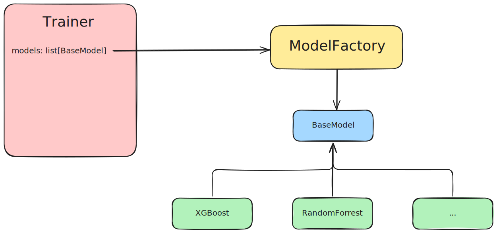

# Training

## Adding New Experiments

To train a new model, it must be added under models in `settings.yaml`. The trainer is provided a list of models from models section and instanciates them with the `ModelFactory`.

### Adding new Models

To Add a new model it must inherit from the `BaseModel`and therefore implement its `optimze` method to run a *Optuna* hyperparameter optimization study.

The existing models `RandomForest` and `XGBoost` serve as examples.

## Versioning of Training Data
To ensure versioning of training data, the data is stored as an artifact for each experiment. Additionally, all relevant metrics for the model are logged in MLflow. Each training dataset is evaluated as described, and the corresponding information is stored as artifacts in the MLflow backend.

## Automated Analysis of New Data

### Goal

The automated analysis checks whether newly incoming data still matches the data originally used for model training. This ensures that the model continues to make reliable predictions in the future. Changes in data structure or distributions can be detected and addressed early on.

The analysis runs automatically, creates an HTML report, and saves all results as artifacts in MLflow.

### What is specifically done?

#### 1. Comparison of old and new data

- Have columns been removed or added?
- Have data types changed?
- Are there changes in the value range for numerical variables?
- For categorical variables, have categories been added or removed?

#### 2. Examination of distributions

- Target variable ("income"): Has the distribution changed?
- For all features: Graphical comparison of the distribution between old and new datasets

#### 3. Calculation of correlations

- Which features correlate strongly with the target variable?
- Are there strong correlations between individual features?

#### 4. Further data quality checks and handling instructions

- Check for missing values (NaN or "?")
- Identification of duplicates
- Check for highly imbalanced features (e.g., features where a single value accounts for over 95% of the data)

### Next steps

The code developed here allows for quick and systematic identification of potential problem areas in the data in the future. It also provides concrete suggestions on which cleanups should be performed before retraining the model if necessary.

## Data Preparation

Data preparation is performed using an `sklearn` pipeline as seen in the example models. Each model can use a “customprocessor” and a “preprocessor” to prepare the data. The “customprocessor” adjusts the fields according to the findings from the data evaluation. The preprocessor is used to encode the categorical data “one-hot”, for example, or to use a `MinMaxScaler` for numerical values. This pipeline is stored together with the model in the MLflow backend after training and is used for inference. This ensures that all data is processed consistently within the model.

## Hyperparameter Tuning

For the example models, hyperparameter tuning is performed. The best result from this Optuna study is then stored in MLflow Models for each model. The value ranges for hyperparameter tuning are defined in the respective model class.

## Labeling of models

The latest model is labeled as newest. Note that multiple experiments may result in multiple models labeled as newest. It is recommended to use labels such as "Production" and "Staging" to maintain clarity when accessing models via the backend. This labeling must be performed manually in the MLflow backend to ensure a clear transition between staging and production.

## Adding new data

New training data can be added via Fileupload to the backend. When new training data is added, retraining is performed, and the training data, model, and corresponding results are stored. If the model should be deployed to production, it must be labeled accordingly and loaded into the backend via the /set_model endpoint. The settings.yaml file allows specifying the general path for training data and the path to the original training data. During training, a comparison between the current and original training data is performed and documented in report.html in the artifacts folder. Additional visualizations of the training dataset can also be found in the artifacts folder. The training of new models occurs in the background and does not block the API
